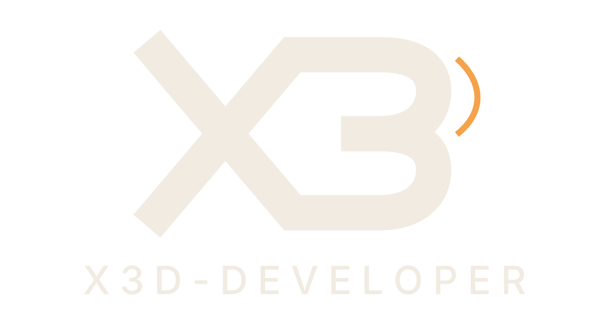

<h1 align="center">
   
  
   
  X3D Carry
   
</h1>

  <a href="../../README.md">🇬🇧 English</a> •
  <b>🇹🇭 ไทย</b>

<h4 align="center">ระบบอุ้มผู้เล่น/อุ้มศพ FiveM — อุ้มศพ อุ้มพาดบ่า ขี่หลัง, ขออนุญาตก่อนอุ้ม, เซิร์ฟเวอร์ตัดสินทั้งหมด, UI Vue 3</h4>

  
  
  
  
  

  <a href="https://fivem.x3d-developer.com/th/products/x3d-carry/">🌐 หน้าสินค้า</a> •
  <a href="https://discord.gg/x3d-developer">💬 Discord</a> •
  <a href="https://fivem.x3d-developer.com">🛒 สคริปอื่น ๆ (ฟรี + พรีเมียม)</a>

---

## ✨ คุณสมบัติ
- **อุ้มศพ · อุ้มพาดบ่า · ขี่หลัง**
- ต้อง**ขออนุญาต**ก่อนถึงจะอุ้มคนเป็นได้
- **เซิร์ฟเวอร์เป็นคนตัดสินทั้งหมด** — ใช้ช่องโหว่อุ้มข้ามแมพไม่ได้
- **UI Vue 3 + Nuxt** สเกลตามความละเอียดจอ (1280p–4K)
- addon แจ้งเตือน — ถ้าเซิร์ฟมี `esx_notify` / `ox_lib` อยู่แล้วจะใช้ตัวนั้นให้อัตโนมัติ ไม่มีก็ใช้การ์ดของตัวเอง

## 📦 ติดตั้ง
1. วางโฟลเดอร์ `x3d-carry` ใน `resources/`
2. ใส่ `ensure x3d-carry` ใน `server.cfg`
3. ปรับค่าใน `config.lua`

## 💬 ซัพพอร์ต & อัปเดต
ซัพพอร์ตและเวอร์ชันใหม่อยู่ที่ **[Discord](https://discord.gg/x3d-developer)** และ **[เว็บไซต์](https://fivem.x3d-developer.com)** — ไม่ใช่ GitHub issues

## 📄 ลิขสิทธิ์
ฟรีสำหรับใช้ในเซิร์ฟเวอร์ของคุณ · **ห้ามขายต่อ / แจกจ่ายเพื่อการค้า** · © X3D Developer
